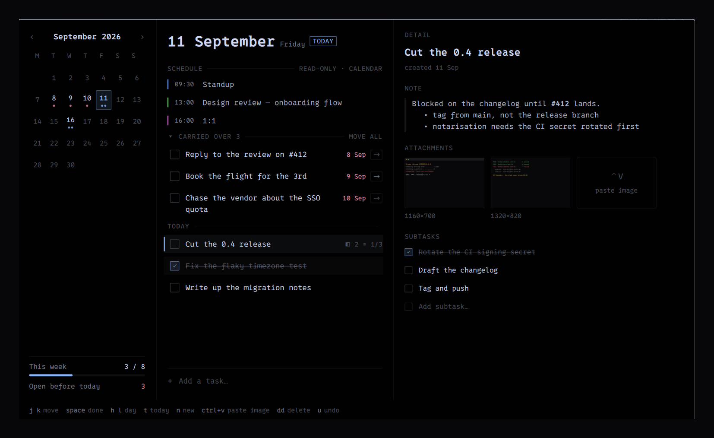

# Days

A task list that belongs to a day.

Tasks are written on a date and stay there. Each one opens into a page with a
Markdown note, screenshots you paste straight from the clipboard, and subtasks.
The day's calendar events sit above the list, read-only. Everything lives in
your home directory and nothing leaves the machine.



## What it does

**A day, not a backlog.** A task belongs to the day it was written on. Today's
pane opens with a **Carried over** section listing everything still open from
earlier days, each with the date it came from, and a button to move it here.
Nothing moves on its own — so last Wednesday still shows what last Wednesday
actually held, and a task deferred eleven times looks different from one
written this morning.

**Screenshots on the task.** `Ctrl+V` in the detail pane stores whatever image
is on the clipboard, or imports it if what you copied was a path to one.
Identical images are stored once no matter how many tasks point at them.

**Notes in Markdown.** The note renders where it sits and becomes an editor
when you click it. No preview toggle, no second mode.

**Your calendar, beside it.** If [Omarchy Google Calendar and
Clock](https://github.com/omarchy-plugins/omarchy-google-calendar-clock) is
installed, the day's events appear above the task list. Days reads them through
that plugin's own read-only bridge and never creates, changes or syncs
anything. That bridge takes a couple of seconds to answer, so each day's events
are cached on disk: the schedule is there the moment the overlay opens, and a
fresh answer replaces it when it arrives.

**One key, nothing on the bar.** Days is an overlay and only an overlay. That
is not just taste: a plugin that declares a bar widget is only "enabled" while
it holds a slot on the bar, so four separate settings have to survive for the
key to work. With no bar widget there is one, and `scripts/setup` puts it back.

## Install

```
omarchy plugin add leonrlr4/days
~/.config/omarchy/plugins/leonrlr4.days/scripts/setup
```

`scripts/setup` enables the plugin, binds `SUPER + M` in your `bindings.lua`,
and installs a post-boot hook. It is idempotent — run it any time, and
`scripts/setup --check` reports what is missing without changing anything.

The hook matters more than it sounds. Whether a plugin is enabled lives in
`~/.config/omarchy/shell.json`, which the shell rewrites constantly and which
can be restored from an older backup — taking every plugin installed since with
it. When that happens the plugin is still on disk, the key is still bound,
Hyprland still has it, and pressing it does nothing, because what it toggles is
no longer loaded. The hook re-applies the setup on every login, so that repairs
itself before you notice. `--no-hook` skips it.

Pick a different key with `--key "SUPER + D"`, or skip the binding with
`--no-key`. `SUPER + M` is free in a stock Omarchy install; `SUPER + T` toggles
floating and the whole comma family belongs to notifications.

Requires `wl-clipboard`, `imagemagick` and `jq`, all of which a stock Omarchy
install already has.

## Keys

| | | | |
|---|---|---|---|
| `j` `k` | move between tasks | `h` `l` | previous / next day |
| `space` | complete | `t` | back to today |
| `n` | new task | `Ctrl+V` | paste an image onto the task |
| `dd` | delete | `u` | undo the delete |
| `Esc` | close | | |

Clicking works everywhere too: a date in the month grid, a checkbox, a row, the
note, a thumbnail. Right-click a thumbnail to remove it.

## Where your data is

```
~/.local/share/leonrlr4.days/
  days/YYYY-MM-DD.json   one file per day
  blobs/<sha256>.<ext>   images, stored under their own content hash
  thumbs/<sha256>.webp   320px renditions, the only thing lists load
  index.json             a cache: open tasks, per-day counts, image refcounts
  events/YYYY-MM-DD.json a cache of the day's calendar events
```

Plain JSON, one small file per day — readable, greppable, and trivial to back
up or put in a git repo. `index.json` and `events/` are both derived and can be
deleted at any time; the index is rebuilt from the day files on the next open,
and the events are re-fetched.

Removing the last reference to an image runs `scripts/gc-blobs`, which
re-derives what is still referenced from the day files themselves before
deleting anything, and refuses to delete at all if any day file cannot be read.
Run it by hand to sweep the whole store:

```
scripts/gc-blobs --dir ~/.local/share/leonrlr4.days
```

## Tests

```
tests/run
```

Head-less, no packages beyond what the plugin already needs. The data layer is
plain JavaScript in `lib/Store.js` so it can be exercised without a shell;
`tests/test_qml.qml` pins the two QML behaviours the UI depends on, both of
which fail silently and confusingly when they are wrong.

## Licence

MIT.
